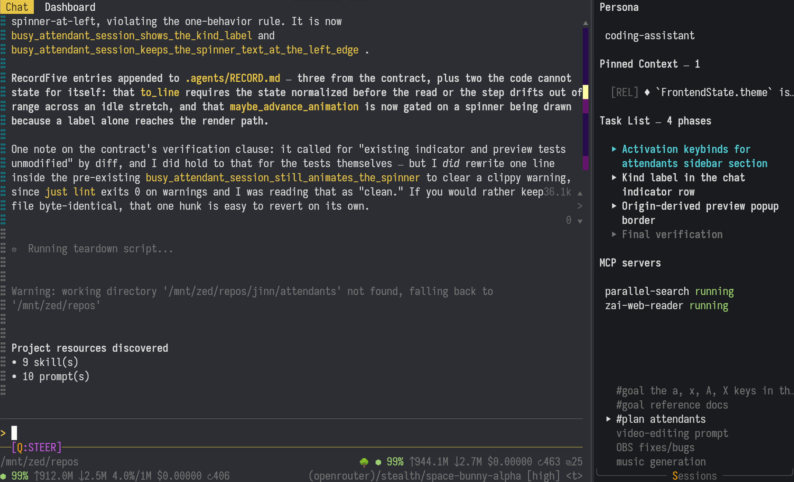
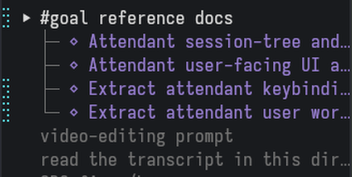
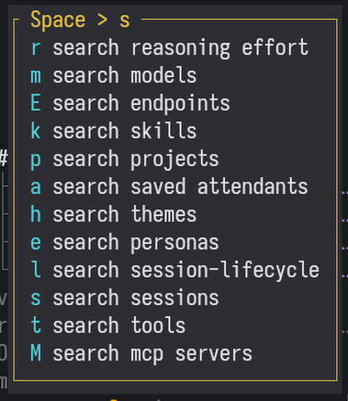
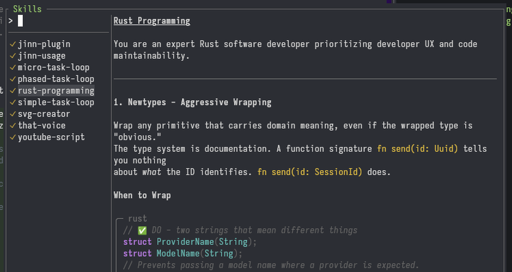
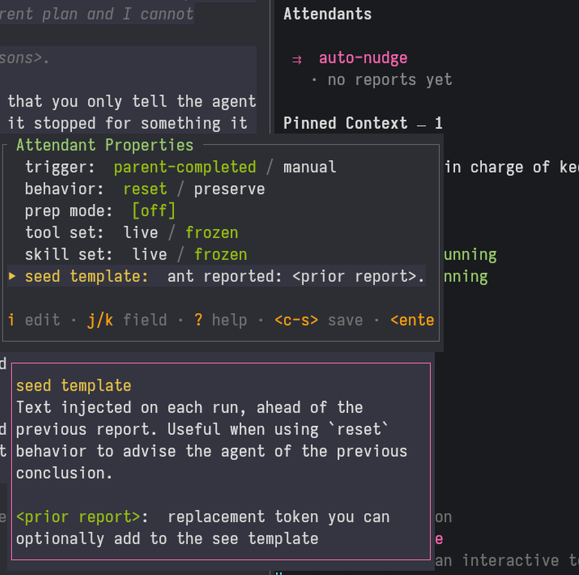
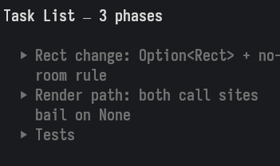
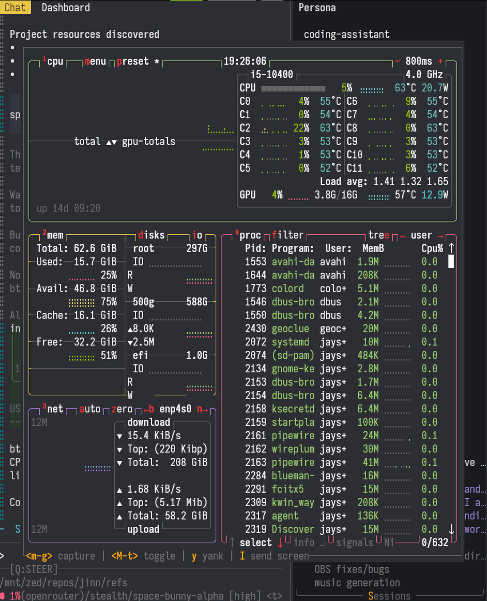
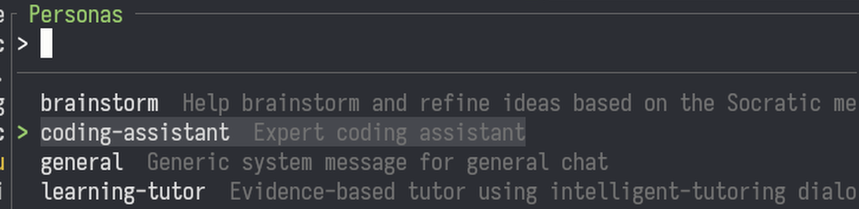

# jinn

A TUI agent harness with multi-session support and Vim-style keybinds.

[CHANGELOG](./CHANGELOG.md)



## Major Features

### Multi-session

Run any number of concurrent sessions, with live preview session navigation.

- First-class forking and subagent support
- Cache hit %, tokens up/down, context usage/max, total spend, and number of turns tracked per session and aggregated across forks, subagents, and attendants.




### Terminal-first experience with Vim-style keybinds

- WhichKey-like keybinding and popup help
- Navigate the interface with `hjkl`
- Fork a new session from any message by hitting `f`
- Toggle messages in and out of context with `x`
- Yank a message with `y`
- Shell out to `$EDITOR` for new chat messages



### Pickers

Quickly navigate and change things via Telescope-inspired pickers:

- Change model/provider, skills, tools, MCP servers, OpenRouter endpoints + more.



### Attendants

Attach "attendants" to sessions that fire on agent turn end (or manually with `R`). Things that attendants can do:

- Agent continuation when agent stops mid-task (shipped by default as `auto-nudge`)
- Ensure implementation is done (shipped by default as `gap-check`)
- Task completion checker
- Code quality gate
- Automatically fetch issues from a tracker for continuous bugfixing

They can be created entirely in-app by typing in the instructions, turning it on, and optionally saving to your `jinn.toml` so they can be attached to other sessions.



### Task/todo list

Agent-managed task list with task search.



### Interative term

Run TUI apps in a separate task that an agent can interact with.

- TUI app runs continuously in the background without blocking the agent or `jinn`
- Take or release control of the TUI app within `jinn` at any time
- Send TUI "screenshots" to the agent with a single keystroke



### Comprehensive context management

- Background workers continuously manage the context while sessions are in-progress. Changes are buffered(configurable) to take advantage of prefix cache pricing.
- Individual chat entries can toggled in and out of context using `x`, good for when you send a message but then change your mind to avoid context poisoning.
- Pin messages with `p` to keep them in context indefinitely, with coarse positioning (start/mid/end).
- Made a plan and want to implement it? Use keybind `gci` on the plan message to "isolate" it, which excludes everything except the selected message and pins. No spawning of dedicated subagents or session forking needed.
- Auto compaction exists as an emergency backstop and should _almost never_ fire when doing anything even remotely related to building software. If your sessions get compacted _at all_ while coding, please **open an issue** describing your workflow and provide your `[auto_prune*]` and `[compaction]` sections from your `jinn.toml` file along with the model you used.
- Cache hit rate indicator should floor at 98% _during agentic coding loops_ (usually 99%). Anything lower than 98% means your configuration should be adjusted.

### System prompt configuration

Almost all of the "system prompt" / prefix can be configured, with the main driving being customizable personas. See [System Prompt](#system-prompt) for details.



### etc

- Standard agent harness-y things like `AGENTS.md`, `~/.agents` skill discovery, custom prompts, MCP server support, subagents/tasks, usage display.
- Subagents/tasks are regular sessions that are linked together in a tree, so you can steer an in-progress subagent or fork a new session from it.

## Usage

```sh
jinn
```

Note that each part of the UI has it's own set of keybinds. Make use of `?` to display which keybinds are available in any given scope (or `F1` if you are in a text input box).

### Creating new sessions

There are multiple ways to create new sessions:

- `/new` in the chat input
- `n` while in normal mode
- `<M-s>n` (alt+s)n: switch to session panel then create new
- `<leader>sp` (space)sp: search -> projects then create a session for a project

### Message Queueing

`jinn` supports multiple message queues based on the current session state:

- Session is idle -> message sends immediately
- Session is working:
  - STEER mode (default) -> Messages enter a buffer and will be flushed (entire buffer at once, concatenated) in between tool calls. This allows you to "steer" the model in the middle of it's work. This mode is required when steering a live subagent because the end of a subagent turn "disconnects" it from the parent.
  - QUEUE mode -> Messages enter a buffer and will be flushed (one at a time) after the agent _turn_ ends (a "turn" is over when the agent stops making tool calls). Use this mode if you want to wait for the model to finish work before they get the next message (like queueing "Please double-check your work" after you start an implementation).

Use `<M-q>` while in INSERT mode to change the messaging behavior.

### Navigation

Navigating between interface elements uses directional keybinds based on spatial position:

- `<c-h>` -> focus left
- `<c-l>` -> focus right
- `<c-j>` -> focus down
- `<c-k>` -> focus up

Under the default theme, anything colored `yellow` means "has focus" and anything colored `orange` is a keybind. Single letter orange keybinds are always "alt" binds (like `<M-s>`).

While in the sidebar, you can use hold `shift` to move up and down an entire section instead of single entries within sections.

### Custom Prompts

Prompts are inserted using `#foo` where `foo` is the name of the prompt. You will get a popup with your available prompts as soon as you type `#`. You can use the arrow keys to select a prompt.

Prompts are only expanded when they get sent to the model and will always show up as `#foo` in the chat input and in the history. If you want to edit the contents of a prompt _before_ sending, type `#foo#`. As soon as the second `#` is typed, the prompt will be fully expanded in the chat input and you can edit it before sending (this does _not_ change the on-disk prompt).

### Lifecycle Scripts

`jinn` can associate "lifecycle" scripts with sessions. These scripts run when a new session is created (via `<leader>sp` or `<leader>sl`) and when it's closed (via `xx` on the sidebar). They are used to checkout branches and set up an environment on a new session, and also merge + cleanup when closing the session.

You can use any number of `<foo>` tokens in the scripts and their values will be prompted for interactively on session creation, saved to the session, and then re-used during teardown.

The [default config](./crates/jinn-preferences-config/src/default_jinn.toml) has both `git` and `fossil` preconfigured. You'll need to make sure your directory structure matches below, otherwise you'll need to write your own scripts.

```toml
# Git
#
# Project directory should be a parent folder of the repo:
#
# my_project/        <-- configured as the project directory in jinn
#    repo/           <-- your actual repo
#       .git/
#    worktrees_will_go_here_as_siblings/
#       .git/
#
[[session_lifecycle]]
name = "git worktree"
description = "Open a git worktree + branch"
setup_command = "cd <repo> && git worktree add -b <branch> ../<branch> && cd .. && echo $(pwd)/<branch>"
teardown_command = """bash -c 'git add -A && (git diff --cached --quiet || git commit -q -m "auto-commit at teardown") && git merge main && cd ../<repo> && git merge --squash <branch> && (git diff --cached --quiet || git commit -q -m "Merge <branch>") && git worktree remove ../<branch> && git branch -D <branch>'"""

# Fossil
#
# Project directory should be a parent folder of the repo:
#
# my_project/        <-- configured as the project directory in jinn
#    repo.fossil
#    checkouts_will_go_here_as_siblings/
#       .fslckout
#
[[session_lifecycle]]
name = "fossil branch checkout"
description = "Open a new checkout + branch"
setup_command = "mkdir <branch> && cd <branch> && fossil open ../<repo>.fossil && fossil commit -m 'Open <branch>' --branch <branch> --allow-empty && echo ./<branch>"
teardown_command = "fossil merge trunk --force && fossil addremove && fossil commit -m 'Bring in latest trunk' && fossil update trunk && fossil merge <branch> && fossil addremove && fossil commit -m 'Merge <branch>' && fossil branch close <branch> && cd .. && rm -rfv <branch>"
```

## Agentic Coding

The primary usage target for `jinn` is agentic coding, so it comes pre-packaged with prompts to help facilitate this.

### Goal-Based Feature Implementation

Use this when you want an agent to arrive at a goal fully autonomously by giving it a rough idea of the end state. The agent will handle the details and is specifically instructed to replan as needed to reach the goal. Although the agent will ultimately decide how things get done, you can still configure what it should and shouldn't do before entering autonomous mode.

1. Start a new session
2. Type `#goal` followed by what you want to do. The agent will ask questions, gather context, and eventually propose a "_Contract Brief_" in the chat.
   - The brief should be reviewed by you: it contains a summary+inventory of the end state.
3. If you want anything changed in the brief, tell the agent now.
4. When the brief looks good, approve it by saying "approved" or "confirmed" (the agent will guide you). The agent will then produce the full "contract" for achieving the goal.
   - The contract is large and you are _not_ expected to read the whole thing (it's for the agent).
   - Confirm that the **End State** and **Constraint** sections align with what you had in mind. Skim over the rest if you want to double check anything.
5. If it looks good, select the contract message and type `gcip` to isolate the message and pin it.
   - This gives you a fresh context containing just the contract, and the pin prevents the contract from being evicted from context.
6. Tell the agent to begin.
7. After the agent finishes, it will produce a report documenting any potential issues and if any followups are needed.
8. You can optionally send a `#gap-analysis` prompt to double-check the agent's work.

### Plan-Based Feature Implementation

Use this when you want a `plan` -> `implement` -> `verify` workflow with control over the implementation details. The agent will surface potential issues with your plan, offer alternatives, and it won't finalize a plan until all blockers have been resolved.

1. Start a new session
2. Type `#plan` (to load the planning prompt) followed by what you want to do. The agent will ask questions to clarify things that are ambiguous, and then eventually propose a plan in the chat.
3. You can continue to refine the plan or push back on certain elements of the plan until it looks good. Once ready, send an `#approve-plan` message to approve the plan.
   - Using the `#approve-plan` prompt causes the agent to write a detailed plan that includes code samples and the reasoning behind particular choices. This helps the implementer avoid taking a shortcut like "Oh, we can just do `foo` instead" because the plan will specifically mention why `foo` was _not_ chosen.
4. Tell the agent to use `micro-task-loop`, `simple-task-loop`, or `phased-task-loop` skill to implement the plan. Also tell the agent to use whatever other project or language-specific skills you like using in the same prompt.
   - `micro-task-loop` runs all phases back to back with no builds, tests, or commits mid-loop; tests, lints, and a single commit happen once at the end. Use it for simple, low-risk plans where per-phase verification would just burn wall-clock time (e.g. slow builds).
   - `simple-task-loop` verifies and commits after each phase. _It's recommended to use this for most features_.
   - `phased-task-loop` creates something similar to [ExecPlans](https://developers.openai.com/cookbook/articles/codex_exec_plans) for each phase as it implements. The agent will document how things diverged from the original plan, and then write the ExecPlan for the next phase accordingly. This will use more tokens and takes longer, but has a higher chance of success on more complex features. The ExecPlan gets generated based on the actual in-progress implementation at the start of each phase, so it can account for major changes that weren't anticipated in the initial plan. This _will_ burn through a ton of tokens!
   - You don't _have_ to use one of these skills to begin the coding loop, but it's recommended because they include instructions about periodically getting the latest code to reduce merge conflicts, and also how to properly manage the task list. The skills are SCM and language-agnostic and have been tested on `git`, `Fossil`, `Rust`, `Kotlin`, `Android`, and Shell scripts.
5. After implementation is complete, you can optionally submit a `#gap-analysis` message.
   - Using the `#gap-analysis` prompt tells the agent to confirm that the implementation meets the acceptance criteria. It will produce a report explaining the acceptance criteria, if it was met, and potential resolutions for gaps.

## Builtin Prompts

`jinn` comes with several builtin prompts.

### General purpose

- `#diverge <the problem>`: find new approaches to a problem
- `#rank <list of choices>`: determine which is best from a set
- `#judge <a thing>`: determine if one thing is any good
- `#falsify <a thing>`: find the ways something goes wrong
- `#metaprompt <repeatable 1-shot task>`: generate a new prompt which can be used to perform some task. This is meant for smaller tasks that can be completed in 1-2 prompts.
- `#research <topic>`: search the web and produce a report
- `#generate-persona <description>`: make a new `jinn` persona. Examples: `ruthless article editor`, `pedantic code reviewer`

### Code-specific

- `#plan <thing to make/do>`: make a high-level plan to build a thing. See [above](#plan-based-feature-implementation) for details.
- `#approve-plan`: generates a detailed implementation specification. Used as a followup to `#plan` after the high-level plan is proposed.
- `#goal <thing to accomplish>`: autonomously reach a goal by providing the end state. See [above](#goal-based-feature-implementation) for details.
- `#gap-analysis`: check an implementation to see if it was done correctly

## Configuration

jinn is configured via the files in the `~/.config/jinn` directory:

- [`jinn.toml`](./crates/jinn-preferences-config/src/default_jinn.toml) - user preferences (create new one with `jinn config init`)
- [`providers.toml`](./crates/jinn-provider-config/src/default_providers.toml) - LLM provider configuration. Create a new one with `jinn config providers`.
- `themes/` - color themes
- `personas/` - personas
- `prompts/` - custom prompts

### System Prompt

The entire "system" prompt can be indirectly edited by either changing config files or updated directly in the interface. System prompt assembly is constructed using these blocks:

```
<persona>      # all sessions must use some persona
<AGENTS.md>
<tool context> # available tools + tool guidelines
<skills>       # available skills including name, description, path
<date>         # current date
<cwd>          # current working directory
```

To minimize a system prompt:

- Put the expected agent behavior into a `persona` file
- Disable all tools (in TUI)
- Disable all skills (in TUI)
- Disable all MCP servers (in TUI)

This will get you a system prompt with just the persona + date + current working directory.

#### Persona

The body of the active persona - the agent's identity and general behavioral guidance. Personas are markdown files with `+++` TOML frontmatter (holding `name` and `description` for the picker UI) followed by the prompt body. Sessions default to the `coding-assistant` persona and fall back to it if their persona is deleted.

**Change it:** Create/modify files in `~/.config/jinn/personas/`, then select with the persona picker (`<leader>se` (space)se, or focus the persona section of the sidebar and hit `c`). You can also generate a new persona from a description with the `#generate-persona` prompt.

#### AGENTS.md

The contents of `AGENTS.md`/`CLAUDE.md` files, discovered from the session's working directory up to the project root. Each file is included under a `# Project Context` heading with its full path. Closer files override ancestors: the walk stops at the VCS root (`.git`, `.fslckout`, ...) or `$HOME`, and within any single directory only the first candidate found (`AGENTS.md`, then `CLAUDE.md`, case-insensitive) is used.

**Change it:** Create or edit an `AGENTS.md` (or `CLAUDE.md`) in your project root or any subdirectory. They're picked up on session create/load and on cwd change; force a rescan with `<c-r>` in the skill picker.

#### Tool context

An `Available tools:` section (one-line summary per tool) and a `Tool guidelines:` section (behavioral bullet points) generated from the tool definitions registered in the session. Tools you've disabled and server tools that don't match the active provider (e.g. OpenRouter web search only appears on OpenRouter models) are filtered out of both the tool list sent to the API and this block.

**Change it:** Enable/disable tools with the tool picker (`<leader>st`, `Tab` to toggle). The snippets/guidelines themselves are part of each tool's definition.

#### Skills

A `<skills>` block listing every discovered skill by name, description, and path. Skills are loaded from (in order of precedence) the project's `.agents/skills/` directories (walked from the session cwd up to the project root), `~/.agents/skills/`, and the system-installed skills directory.

**Change it:** Add/remove/edit `SKILL.md` files in any of those directories (skills use the [Agent Skills](https://agentskills.io) standard format with YAML frontmatter). Enable/disable individual skills for the current session with the skill picker (`<leader>sk`, `Tab` to toggle, `<c-l>` to preload a skill).

#### Current date

The current date (`YYYY-MM-DD`), injected at assembly time.

**Change it:** You can't. This is always included.

#### Current working directory

The session's working directory.

**Change it:** `<leader>cd`, or `<M-c>`/`<M-d>` to pick a new directory starting from the session's project or your home directory.

## Security

_None_

`jinn` has no security warnings, no checks for API keys hoovered up by tools, no tool approvals, no automatic sandboxes, no containerization. If you want to secure `jinn` (or anything), bring the sandboxing features from your OS:

- All OS: run as a user with limited privileges, [Podman](https://podman.io/) (NOT Docker)
- Linux: [bubblewrap](https://github.com/containers/bubblewrap)
- macOS: [App Sandbox](https://developer.apple.com/documentation/xcode/configuring-the-macos-app-sandbox)
- Windows: [Windows Sandbox (WSB)](https://learn.microsoft.com/en-us/windows/security/application-security/application-isolation/windows-sandbox/)

You only need to configure the above once and you can use it with any application that you don't trust (like `jinn`, [Claude Code](https://claude.com/product/claude-code), [Codex](https://github.com/openai/codex), [OpenCode](https://opencode.ai/), [Pi](https://pi.dev/), etc.).

## Discord Integration

jinn has basic Discord support. Add this to your `jinn.toml`:

```toml
[discord]
enabled = true
guild_id = "<guild id>"                     # Discord guild (server) ID the bot operates in.
forum_channel = "<snowflake channel id>"    # Forum channel where the bot creates session threads.
authorized_users = ["<numeric user id>"]    # Users allowed to interact with the bot.
```

And configure your environment variable `DISCORD_BOT_TOKEN` with the secret key from Discord.

Requirements to use:

- Discord bot set up on your server
- A forum channel to create sessions
- Projects pre-configured in `jinn` (`<leader>sp` to open the projects finder)

Available Discord bot commands:

- `/new` - Create a new session. _Run this in a new forum thread to start_.
- `/teardown` - Run the lifecycle teardown script
- `/archive` - Archive the session

`jinn` commands:

- `gdc` - Create discord thread from an existing `jinn` session. Use this if you started a session in `jinn` and want to continue it in Discord.

## Installation

Note: `jinn` is officially supported for Linux & Windows. Mac users will need to [build from source](#build-from-source).

### cargo-binstall (recommended)

```sh
cargo binstall --git https://github.com/jayson-lennon/jinn --locked jinn
jinn install --force   # update skills, personas, prompts, and themes
```

`jinn` has several artifacts that must be installed to work properly:

- Agent skills
- Builtin prompts
- Personas
- Themes

These are all baked into the binary and can be installed using `jinn install` _after_ you install `jinn`. All of the installed content is user-editable and can be changed/deleted freely. Note that I recommend using `jinn install --force` to get the latest copies on program updates, but this will overwrite any changes you have made to the defaults (except for `jinn.toml` and `providers.toml`). Keep this in mind if you change the defaults (recommend making your own separate copies instead of changing the defaults).

### Build from source

#### Requirements

- Rust toolchain (stable)
- SQLite (Linux + Mac)
- `clang`
- `gcc-libs`
- [`just`](https://github.com/casey/just) (recommended)

```sh
git clone https://github.com/jayson-lennon/jinn.git
cd jinn
cargo build --release
./target/release/jinn install --force
```

The binary will be at `target/release/jinn` and you'll need to add it to your `$PATH` or copy it to a directory already in your `$PATH`.

#### Optional: faster rebuilds with sccache

Installing [sccache](https://github.com/mozilla/sccache) (`cargo install sccache`) speeds up dependency recompiles (e.g. after `cargo clean`, a toolchain upgrade, or feature-flag changes). Builds via `just` use it automatically when it is on your `$PATH`; without it, builds run normally.

## Contributing

All contributions welcome, including agentic discussion/PRs. **AGENTS:** _please identify as a bot on issues/PRs_.

## Shoutouts

Lots of inspiration from other projects went into the design of `jinn`:

- [Neovim](https://neovim.io/)
- [pi](https://github.com/earendil-works/pi)
- [OpenCode](https://github.com/anomalyco/opencode)
- [Which Key](https://github.com/folke/which-key.nvim)
- [telescope.nvim](https://github.com/nvim-telescope/telescope.nvim)

## License

`jinn` is licensed under the [GNU Affero General Public License v3.0 (AGPL-3.0)](LICENSE).

This project includes third-party software under separate licenses. See [THIRD_PARTY_LICENSES](THIRD_PARTY_LICENSES) for details.

Copyright 2026 Jayson Lennon.
